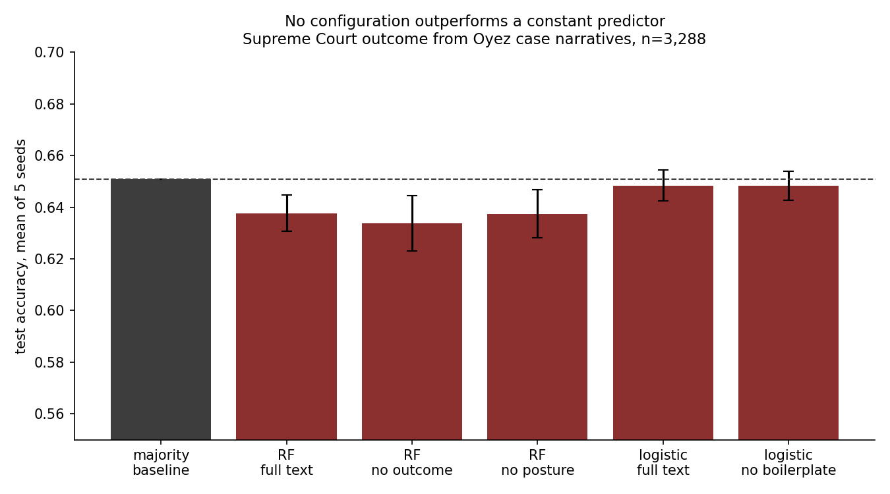

# Predicting Supreme Court outcomes from case narratives: a validation audit

We are trying to answer if a text classifier can predict which side is victorious in a Court case from a summary of its facts.

Based on this dataset, no. We have tried a TF-IDF and Random Forest pipeline and it reaches a **63.8% accuracy against a majority-class baseline of 65.1%**. We tested six configurations and none clear the baseline.

While the pipeline produces a confident-looking ranking of words that supposedly "drive judicial outcomes", it has no demonstrated predictive skill at all. This is a record of the checks that show that, and also what I am trying next.



## Results

Mean of five stratified 80/20 splits. Minority class is "first party loses".

| Model | Accuracy | ±sd | AUC | F1 (minority) |
|---|---|---|---|---|
| Majority-class baseline | 0.651 | — | 0.500 | 0.000 |
| Random forest, full text | 0.638 | 0.007 | 0.573 | 0.195 |
| Random forest, outcome language removed | 0.634 | 0.011 | 0.571 | 0.188 |
| Random forest, outcome + posture removed | 0.637 | 0.009 | 0.555 | 0.245 |
| Logistic regression, full text | 0.648 | 0.006 | 0.569 | 0.095 |
| Logistic regression, boilerplate removed | 0.648 | 0.006 | 0.560 | 0.098 |

Under a temporal split — training on terms up to 2011, testing on 2012 onward — the model reaches 0.660 against a 0.671 majority rate on that test set. Same situation.

Random forest figures shift by a few thousandths across scikit-learn versions, well inside the reported spread. Logistic regression is stable.

## Why accuracy sits below the baseline

The model is not empty. AUC is 0.573, consistently above the 0.500 of a coin toss across seeds, ranking better than chance.

Accuracy cannot express that, because of the imbalance in targets. 65% of cases go to the first party, so a constant predictor scores 0.651. The model only improves on that by predicting a loss some of the time, and to do so profitably it needs to be more than half confident about a specific case. With this much signal it rarely gets there, and the few times it does are close to coin tosses against a guaranteed win. The result is a score slightly below the constant.

Tuning the decision threshold does not rescue it. Optimising the threshold directly on the test set — an upper bound, since that is cheating — reaches 0.657.

The signal does show up if the output is treated as a ranking rather than a label:

| Predicted-probability quintile | Observed first-party win rate |
|---|---|
| Lowest fifth | 0.59 |
| Corpus mean | 0.65 |
| Highest fifth | 0.73 |

## Why the feature importances cannot be interpreted

The obvious thing to do with a fitted Random Forest is plot the top features and call them the drivers of the outcome. `feature_importances_` always returns a ranking, and it has no way to signal that the model it came from does not work.

Here the top terms are procedural words — *court* (present in 90% of documents), *law*, *appeals*, *district*, *state*, *circuit*. None of this is an account of what drives judicial outcomes. It is a description of what a skill-less model happened to fit.

A feature importance plot from a model that fails a baseline comparison is not an explanation. It is decoration.

## Running it

```
pip install -r requirements.txt
python run_audit.py
python diagnostics.py
```

Writes `results.csv`, `feature_audit.csv` and `baseline_comparison.png` and some diagnostic files. Takes about a minute.

## Log

Each entry states a hypothesis before running it, then reports the result against a fixed baseline of 0.651 accuracy and 0.500 AUC. Those two numbers do not move between entries.

- [01 — TF-IDF baseline audit](01-tfidf-baseline.md) *(2026-09-09)* — leakage checks, the boilerplate hypothesis, and what has been ruled out.

Next, in order:

**02 — Frozen transformer embeddings.** Legal-BERT or a sentence-transformer as a frozen encoder, with a small classifier on the pooled representation. *Hypothesis: AUC improves to roughly 0.62–0.65, because a contextual encoder represents negation and party role that bag-of-words cannot. Accuracy probably still does not clear 0.651.*

**03 — Reframed target.** Predict the disposition (affirm versus reverse) rather than which party prevailed, and restrict separately to a single issue area. *Hypothesis: a legally coherent target is more learnable than a positional one, and this is more likely to move the number than any change of representation.*

**04 — Structured features.** Reproduce the feature set the published literature actually uses, as a reference point for how much of the achievable signal lives outside the narrative text.

**05 — Ranking and calibration.** If the useful output is an ordering rather than a label, evaluate it as one: calibration curves, precision at k, and whether the ranking is stable across seeds.

Stopping when AUC plateaus across two consecutive entries, or after 05.

## Data

Supreme Court judgment data compiled from the [Oyez Project](https://www.oyez.org) API, distributed on Kaggle. 3,288 cases after dropping rows with missing facts or outcome, terms 1955–2020. The `facts` field is editorial prose written after the decision, which is what motivates the leakage checks in entry 01.

Code in this repository is MIT licensed. The dataset is third-party and is not covered by that license.
